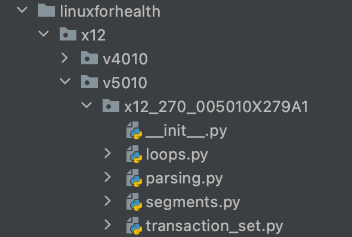

# LinuxForHealth x12 Design Overview

LinuxForHealth x12 parses and validates ASC X12 health care transactions. At the core of the x12 application is
its data model. The data model aligns with the ASC X12 specifications and supports its primary concepts including
fields, segments, loops, and transactions.

## ASC X12 Overview

Segments, loops, and transaction sets are concepts which provide higher levels of grouping within the ASC X12 specification.
Segments are the lowest order of grouping, while transaction sets provide the highest level.

Segments consist of fields.
Loops consist of segments.
Transaction sets consist of loops.

### ASC X12 Fields and Data Types
A field represents a single data attribute with a scalar type. The table below illustrates how LinuxForHealth x12 maps
ASC X12 data types to Python's type system.

| ASC X12 Data Type | Python Type   |
| ----------------- | ------------- |
| Numeric           | int           |
| Decimal           | Decimal       |
| ID                | str           |
| String            | str           |
| Date              | datetime.date |
| Time              | datetime.time |
| Binary            | byte[]        |

### ASC X12 Segments
Segments group a collection of fields into a logical record. For example, the `NM1` segment is a grouping of
fields used to identify an "entity's" name.

```shell
NM1*PR*2*PAYER C*****PI*12345~
```

### ASC X12 Loops

Loops are an organizational grouping within the specification that are not expressed within the X12 message payload.
The specification uses loops to build a higher level record, such as a subscriber or dependent. This higher level
grouping typically adds additional validation constraints to each segment. A segment in one loop typically utilizes
different field constraints than it does in another. 

For example, the `HL` segment's hierarchical level code field, or `HL03`, is used within the Eligibility (270) transaction
to specify the beginning of a new hierarchical record. The permitted values for the `HL03` field differ based on which
loop the segment is in.

* The Information Source Loop/Loop 2000A sets `HL03` to `20`
* The Information Receiver Loop/Loop 2000B sets `HL03` to `21`
* The Subscriber Loop/Loop 2000C sets `HL03` to `22`
* The Dependent Loop/Loop 2000C sets `HL03` to `23`

Finally, the segments below represent an "Information Receiver" loop within the Eligibility (270) transaction. The loop
boundaries are inferred using the transaction set segments.

```shell
HL*2*1*21*1~
NM1*1P*1*DOE*JOHN****XX*1467857193~
REF*4A*000111222~
N3*123 MAIN ST.*SUITE 42~
N4*SAN MATEO*CA*94401~
```

### ASC X12 Transaction Set

The transaction set is the highest level of grouping, and represents a single unit of work. The following X12 message
is a single transaction set.

```shell
ST*270*0001*005010X279A1~
BHT*0022*13*10001234*20131031*1147~
HL*1**20*1~
NM1*PR*2*PAYER C*****PI*12345~
HL*2*1*21*1~
NM1*1P*1*DOE*JOHN****XX*1467857193~
REF*4A*000111222~
N3*123 MAIN ST.*SUITE 42~
N4*SAN MATEO*CA*94401~
HL*3*2*22*0~
TRN*1*930000000000*9800000004*PD~
NM1*IL*1*DOE*JOHN****MI*00000000001~
REF*6P*0123456789~
DMG*D8*19700101~
DTP*291*D8*20131031~
EQ*1~
SE*17*0001~
```

### ASC X12 Control Envelope

The x12 specification requires transaction sets to be nestled within an "envelope" for transmission. In this case the
"envelope" is simply additional segments which contain metadata regarding the message transmission and recipients.
The `ISA`, `GS`, `GE`. and `IEA` segments  are the control segments used to contain the message. The `ISA` and `IEA` are
the opening control header and footer segments, while the `GS` and `GE` segments serve as the functional group header
and footer statements. 

In general terms, the `ISA` and `IEA` segments identify the parties involved in the message exchange. The `GS` and `GE`
segments identify the transaction type within the message payload. The control segments also support checksums (of sorts),
security metadata, and timestamps. 

### ASC X12 File Format

The X12 file format is a simple text based delimited format which dates back to 1979. The initial segment in a X12 
payload, the `ISA` segment, is a fixed length segment used to define the delimiters used in the transmission.

```shell
ISA*03*9876543210*01*9876543210*30*000000005      *30*12345          *131031*1147*^*00501*000000907*1*T*:~
```

| Field Type             | Position (Zero Based) | General Industry Default |
| ---------------------- | --------------------- | ------------------------ |
| element separator      | 3                     | *                        |
| repetition character   | 82                    | ^                        |
| component separator    | 104                   | :                        |
| segment terminator     | 105                   | ~                        |

## LinuxForHealth x12 Data Model

The LinuxForHealth x12 data models extend [pydantic](https://pydantic-docs.helpmanual.io/usage/models) 's BaseModel
implementation. 

The LinuxForHealth x12 data model aligns with the ASC X12 specification and includes:

* [Base models](./x12/models.py) in `x12.models` to support X12 segments and groupings (loops and transactions).
* [Segment models](./x12/segments.py) include all X12 segments used by ASC X12 Health Care transactions.

The segment models define the fields used within a segment, but not the allowable values for a field, or if a field is
optional. These specifications are enforced at the "loop level" within a transaction. The LinuxForHealth x12 
transaction models reside within the `x12.transactions` package. Transaction implementations follow a standard naming
convention of `x12_[transaction code]_[implementation_version]`.

The contents of a transaction package include:



* loops.py - Loop data model implementations.
* parsing.py - Parsing functions used to create loop records within the transactional data model.
* segments.py - Segment subclasses used to enforce loop context validation constraints.
* transaction_set.py - The transaction set model.

### Data Model Hierarchy

X12Segment is the base model class for X12 segments. It includes a `x12` method which transforms the segment to a valid
x12 string.

```python
import abc
from pydantic import BaseModel

class X12Segment(abc.ABC, BaseModel):
    """
    X12BaseSegment serves as the abstract base class for all X12 segment models.
    """

    delimiters: X12Delimiters = X12Delimiters()
    segment_name: X12SegmentName

    class Config:
        """
        Default configuration for X12 Models
        """

        use_enum_values = True

    def x12(self) -> str:
        """
        :return: the X12 representation of the model instance
        """
        x12_values = []
        for k, v in self.dict(exclude={"delimiters"}).items():
            # evaluate fields
    
        x12_str = self.delimiters.element_separator.join(x12_values).rstrip(
        self.delimiters.element_separator
        )
        return x12_str + self.delimiters.segment_terminator


```

The X12SegmentGroup model is the base model used to model a X12 loop or transaction set. The X12SegmentGroup also includes
a `x12` method which generates valid x12 from its contained segments.

```python
import abc
from pydantic import BaseModel
from typing import List

class X12SegmentGroup(abc.ABC, BaseModel):
    """
    Abstract base class for a model, typically a loop or transaction, which groups x12 segments.
    """

    def x12(self, use_new_lines=True) -> str:
        """
        :return: Generates a X12 representation of the loop using its segments.
        """
        x12_segments: List[str] = []
        fields = [f for f in self.__fields__.values() if hasattr(f.type_, "x12")]

        for f in fields:
            # process fields
        join_char: str = "\n" if use_new_lines else ""
        return join_char.join(x12_segments)
```

### Data Model Validation

The LinuxForHealth X12 Data Model supports broad and granular validations expressed at the transaction set, loop, segment,
and field level with Pydantic's `@root_validator` and `@validator` functions.

#### Field Level Validations

Field level validations constrain values based on the underlying data type using Pydantic's Field model or constrained
types.

String field validations may enforce min and max field lengths and pattern conformance (regular expressions).

```python
from x12.models import X12SegmentName, X12Segment
from pydantic import Field

class HlSegment(X12Segment):
    """
    Defines a hierarchical organization used to relate one grouping of segments to another
    Example:
        HL*3*2*22*1~
    """

    segment_name: X12SegmentName = X12SegmentName.HL
    hierarchical_id_number: str = Field(min_length=1, max_length=12)
    hierarchical_parent_id_number: str = Field(min_length=1, max_length=12)
    hierarchical_level_code: str = Field(min_length=1, max_length=2)
    hierarchical_child_code: str = Field(min_length=1, max_length=1, regex="^0|1$")
```

Numeric field validations may enforce value ranges or utilize Pydantic constrained types such as `PositiveInt`.

```python
from x12.models import X12SegmentName, X12Segment
from pydantic import Field, PositiveInt

class IeaSegment(X12Segment):
    """
    Defines the interchange footer and is an EDI control segment.
    Example:
        IEA*1*000000907~
    """

    segment_name: X12SegmentName = X12SegmentName.IEA
    number_of_included_functional_groups: PositiveInt
    interchange_control_number: str = Field(min_length=9, max_length=9)
```

Code-table fields are expressed as string based enumerations within a X12Segment model. Code tables which are not specific
to a given transaction set or loop are defined within the `x12.segments` module. Transaction specific code tables are
defined within the `x12.transactions.<transaction package>.segments` module as "overrides".

```python
from enum import Enum
from x12.segments import RefSegment

class Loop2100RefSegment(RefSegment):
    """
    Conveys additional Subscriber or Dependent identification data.
    """

    class ReferenceIdentificationQualifier(str, Enum):
        """
        Code values for REF01
        """

        PLAN_NUMBER = "18"
        GROUP_POLICY_NUMBER = "1L"
        MEMBER_IDENTIFICATION_NUMBER = "1W"
        CASE_NUMBER = "3H"
        GROUP_NUMBER = "6P"
        CONTRACT_NUMBER = "CT"
        MEDICAL_RECORD_IDENTIFICATION_NUMBER = "EA"
        PATIENT_ACCOUNT_NUMBER = "EJ"
        HEALTH_INSURANCE_CLAIM_NUMBER = "F6"
        IDENTIFICATION_CARD_SERIAL_NUMBER = "GH"
        IDENTITY_CARD_NUMBER = "HJ"
        INSURANCE_POLICY_NUMBER = "IG"
        PLAN_NETWORK_IDENTIFICATION_NUMBER = "N6"
        MEDICARE_RECIPIENT_IDENTIFICATION_NUMBER = "NQ"
        SOCIAL_SECURITY_NUMBER = "SY"
        AGENCY_CLAIM_NUMBER = "Y4"

    reference_identification_qualifier: ReferenceIdentificationQualifier
```

### Segment Level Validations

Segment level validations are implemented within a `X12Segment` model using either Pydantic's `@root_validator` or `@validator`
functions. The `@root_validator` provides access to all fields within the model, while the `@validator` may only access fields 
"up to" the target field.

The following example, the `Nm1Segment`, utilizes both validator types.

```python
from x12.models import X12Segment, X12SegmentName
from enum import Enum
from pydantic import Field, validator, root_validator
from typing import Optional, Tuple

class Nm1Segment(X12Segment):
    """
    Entity Name and Identification Number
    Example:
        NM1*PR*2*PAYER C*****PI*12345~
    """

    class EntityQualifierCode(str, Enum):
        """
        NM1.02 Entity Qualifier Code to specify the entity type
        """

        PERSON = "1"
        NON_PERSON = "2"

    segment_name: X12SegmentName = X12SegmentName.NM1
    entity_identifier_code: str = Field(min_length=2, max_length=3)
    entity_type_qualifier: EntityQualifierCode
    name_last_or_organization_name: str = Field(min_length=1, max_length=60)
    name_first: Optional[str] = Field(min_length=0, max_length=35)
    name_middle: Optional[str] = Field(min_length=0, max_length=25)
    name_prefix: Optional[str]
    name_suffix: Optional[str] = Field(min_length=0, max_length=10)
    identification_code_qualifier: Optional[str] = Field(min_length=1, max_length=2)
    identification_code: Optional[str] = Field(min_length=2, max_length=80)
    # NM110 - NM112 are not used

    @root_validator(pre=True)
    def validate_identification_codes(cls, values):
        """
        Validates that both an identification code and qualifier are provided if one or the other is present

        :param values: The raw, unvalidated transaction data.
        """
        id_fields: Tuple = values.get("identification_code_qualifier"), values.get(
            "identification_code"
        )

        if any(id_fields) and not all(id_fields):
            raise ValueError(
                "Identification code usage requires the code qualifier and code value"
            )

        return values

    @validator("name_first", "name_middle", "name_prefix", "name_suffix")
    def validate_organization_name_fields(cls, field_value, values):
        """
        Validates that person name fields are not used within an organizational record context.

        :param field_value: The person name field (first, middle, prefix, suffix) values
        :param values: The previously validated field names and values
        """
        entity_type = values["entity_type_qualifier"]

        if cls.EntityQualifierCode.NON_PERSON.value == entity_type:
            if field_value:
                raise ValueError(
                    "Invalid field usage for Organization/Non-Person Entity"
                )
        return field_value
```

#### Reusable Validators with Loop and Transaction Set Models

The `x12.validators` module contains common validation functions which are not specific to a transaction set. These
validations are "wired" to the model using explicit syntax rather than decorator functions.

```python
from x12.models import X12SegmentGroup
from x12.transactions.x12_270_005010X279A1.loops import (Loop2100DNm1Segment,
                                                         Loop2100RefSegment,
                                                         Loop2100DInsSegment,
                                                         Loop2100DtpSegment,
                                                         Loop2110D)
from x12.segments import N3Segment, N4Segment, PrvSegment, DmgSegment,HiSegment
from x12.validators import validate_duplicate_ref_codes
from typing import Optional, List
from pydantic import Field, root_validator

class Loop2100D(X12SegmentGroup):
    """
    Loop 2100D - Dependent Name
    """

    nm1_segment: Loop2100DNm1Segment
    ref_segment: Optional[List[Loop2100RefSegment]] = Field(min_items=0, max_items=9)
    n3_segment: Optional[N3Segment]
    n4_segment: Optional[N4Segment]
    prv_segment: Optional[PrvSegment]
    dmg_segment: Optional[DmgSegment]
    ins_segment: Optional[Loop2100DInsSegment]
    hi_segment: Optional[HiSegment]
    dtp_segment: Optional[Loop2100DtpSegment]
    loop_2110d: Loop2110D

    _validate_ref_segments = root_validator(pre=True, allow_reuse=True)(
        validate_duplicate_ref_codes
    )
```

For additional information on validator implementations, please refer to the [Pydantic documentation](https://pydantic-docs.helpmanual.io/usage/validators/).